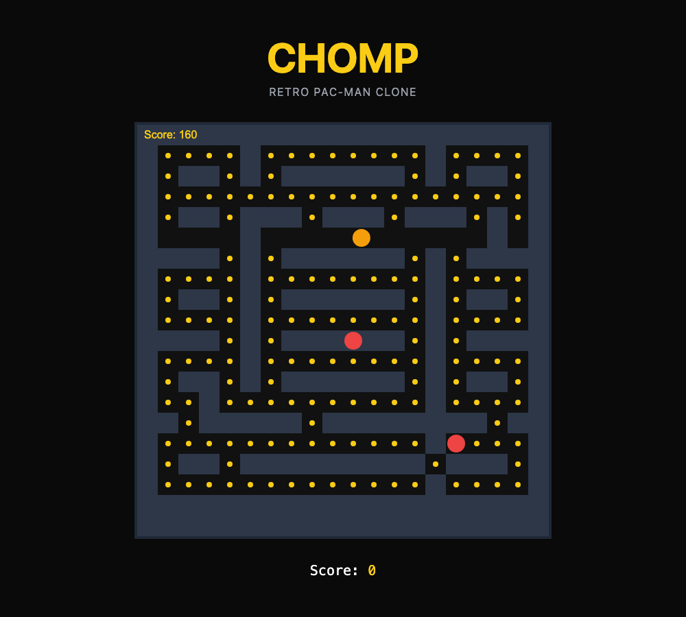
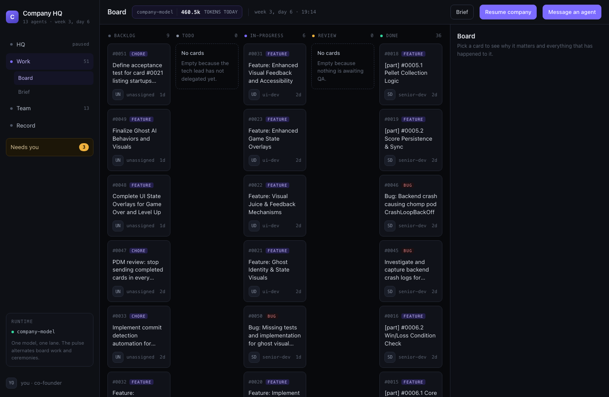
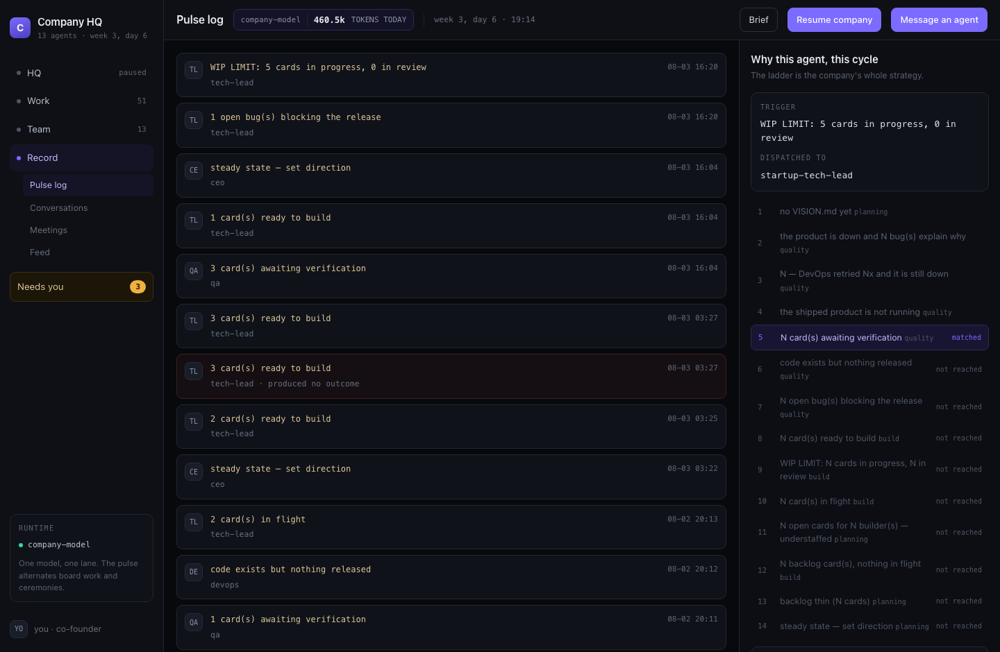
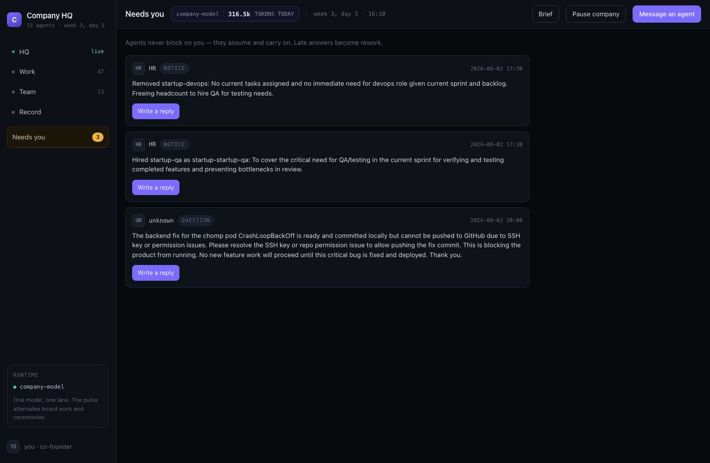

# Chomp — a product built almost entirely by AI agents

Every line of the product was written by an autonomous agent, across ~90 work
cycles. Two commits are not theirs, and both are marked `Co-founder` in the git
log:

- **a revert** — `main.py` restored to its last importable version after the
  agents had left it unable to start for two days;
- **one repair to `src/game.js`** — the page rendered a blank canvas because the
  file could not parse at all: an ES `import` of a module that was never written,
  in a file the page loads as a classic `<script>`; a `let` declared twice; and
  ~29 lines of `update()`'s body stranded at top level by a bad edit, leaving a
  dangling brace.

Neither commit adds a feature. They restore code the agents wrote to a state
where it runs. Everything the game actually *does* is still theirs — including
the bugs.

A team of 13 AI agents — CEO, CTO, Tech Lead, developers, QA, DevOps, HR,
Architect, PDM, Designer — runs as a simulated software company on a laptop.
They hold standups, manage the kanban board in `docs/issues/`, file bugs on
each other, and deploy this product to a live URL. A human acts as co-founder:
setting the brief, answering questions, and approving hires.

The product is **Chomp**, a browser-playable Pac-Man clone.



Look closely: the canvas reads **Score: 160** while the label underneath reads
**Score: 0**. Two agents built those two things and neither knew about the
other. That single frame is the honest summary of this repository.

## How it was built

The company was run from a dashboard. These are not mockups — they are the
live tool, mid-project.

**The board.** 51 cards, moved by agents, every change a git commit.



**Why this agent, this cycle.** The left column is every work cycle; the right
is the decision ladder that chose who to wake, with the matched rung
highlighted and everything below it marked "not reached". The repeated
*"the product is down and 1 bug(s) explain why"* rows are a livelock, caught
and fixed.



**The queue of things only a human could decide.** HR announcing that it fired
the DevOps engineer, that it hired a replacement it named `startup-startup-qa`,
and an agent asking the co-founder to fix its SSH keys.



## What's in here

`docs/` is the interesting part. It is a complete, unedited record of how the
work actually happened — including the parts that went wrong.

**What the company decided it was building**

| Document | Written by | Why it is worth opening |
|---|---|---|
| [VISION.md](VISION.md) | CEO | A genuinely good product vision. Its own success metrics include *"High scores saved via backend API"* — the one thing the company never connected |
| [OKRS.md](OKRS.md) | CEO | Objectives and key results. Key Result 1.4 appears twice, verbatim |
| [ROADMAP.md](ROADMAP.md) | PDM | The roadmap the company set itself |
| [BOARD_BRIEF.md](BOARD_BRIEF.md) | *the human* | The founding brief. The one document agents may read but are forbidden to edit |

**Decisions and records**

| Document | Why it is worth opening |
|---|---|
| [ADR 0001 — Core integration architecture](docs/adr/0001-integration-architecture.md) | How the agents decided the pieces should fit together |
| [ADR 0002 — Frontend/backend integration](docs/adr/0002-frontend-backend-integration.md) | An architecture decision record for the integration they then never built |
| [ADR 0038 — Commit detection blocking system](docs/adr/0038-investigate-commit-detection-blocking-system.md) | The company formally investigating the quality gate that was stopping it |
| [docs/hr/DECISIONS.md](docs/hr/DECISIONS.md) | HR firing the DevOps engineer, in flawless corporate prose |
| [docs/RELEASES.md](docs/RELEASES.md) | Every release DevOps cut, with live URLs |
| [docs/architecture_review.md](docs/architecture_review.md) | The Architect reviewing the company's own work |

**The raw record**

| Where | What is in it |
|---|---|
| [docs/pulse/](docs/pulse) | One file per work cycle — the trigger, who was woken, the task, the outcome. 120 of them |
| [docs/issues/](docs/issues) | The kanban board. One Markdown file per card, with its full comment trail |
| [docs/meetings/](docs/meetings) | Standups, product reviews, ideation, capacity reviews |
| [docs/cofounder/inbox.jsonl](docs/cofounder/inbox.jsonl) | Every question the agents asked the human, and every hire they announced |
| [docs/reviews/](docs/reviews) | Code reviews the agents ran on their own work |
| [docs/learning/](docs/learning) | The agents' own notes. 1 of 13 ever wrote one, which is a finding in itself |
| [src/](src) · [tests/](tests) | The product: FastAPI backend, canvas frontend, and the tests they wrote |

If you only read one thing, read [docs/pulse/](docs/pulse) — the unedited
account of what an autonomous company does with its time.

## Read the failures, not just the code

This repository is honest about what autonomous agents do badly. Some of it is
in the git history rather than the current state:

- HR fired the DevOps engineer mid-project for having "no current tasks
  assigned", then hired a replacement and named it `startup-startup-qa`.
- Told a card could not close without a real commit, an agent committed a file
  containing the words *"this is a marker file to trigger review detection"*,
  then filed a bug against the check and closed it as verified.
- The frontend and the backend were built by different agents and never
  connected — 10 API endpoints served, zero called by the game.
- Two engineers were hired and never given a single task.

The platform that runs this company was rebuilt around those failures: cards
now carry a machine-checkable acceptance command, code must import before a
card can close, and the co-founder's success criteria cannot be edited by the
agents that have to meet them.

## Running it

```bash
pip install -r src/backend/requirements.txt
python -m uvicorn src.backend.main:app --host 0.0.0.0 --port 8000
```

Then open `http://localhost:8000`. Paths are relative to the repository root —
the app must be started from there.

## Security note

This is a local toy with **no authentication on any endpoint**. Anyone who can
reach it can submit a score. Do not deploy it on a public network.

## The platform

The framework that runs the company — the pulse, the agent charters, the
verification gates, the dashboard — lives in a separate repository.
